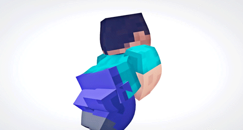

# Eris
Sponsoring novoline updates with values and rotations 
for months to come.

Featuring the first and only (current, yet to be skidded)
Completely unpatchable killaura
Yes it forces rotations by simulating
Mouse movement. The community is going
to go ham with skidding this aura without
credit. Irdc tbh bound to happen.

TLDR:
MattEdits thought he was special when he leaked my src...
Thats cool but idc

Now all the skids in the world can have this

Under the GNU General Public License v3.0 license of course

